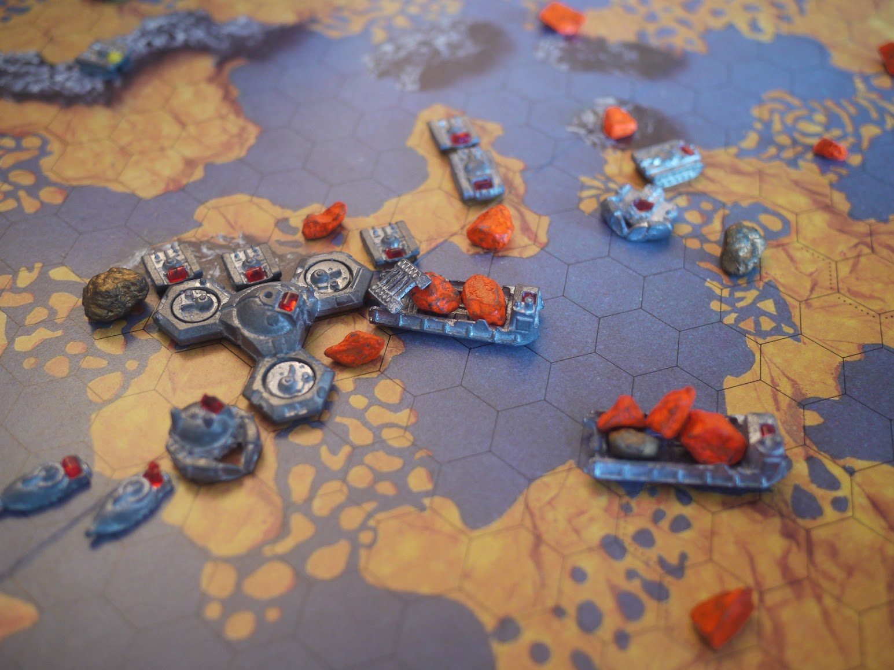

# Full Metal Planete



A web-based implementation of the classic French board game **Full Metal Planete** (1988) - a tactical strategy game where players control futuristic mining expeditions on an alien planet with dynamic tides.

## About the Game

Full Metal Planete is a turn-based strategy game for 2-4 players. Each player commands an astronef (spacecraft) and a fleet of military vehicles on a planet rich in minerals. The goal is to collect as many minerals as possible before your astronef lifts off at the end of the game.

### Key Mechanics

- **Tides**: The planet has three tide levels (low, normal, high) that change throughout the game, affecting which hexes are traversable
- **Action Points**: Each turn grants 15 action points to move units, attack enemies, or collect minerals
- **Unit Types**: Tanks, boats, crabs (amphibious), barges (transport), converters (mining), and defensive towers
- **Combat**: Capture enemy units by surrounding them - no dice rolling, pure tactics

## Features

- Real-time multiplayer via WebSocket
- Faithful hex-grid map based on the original board game
- Full game phase support: Landing → Deployment → Playing → Liftoff
- Astronef rotation during landing phase
- Unit deployment with inventory management
- Lab Mode for local testing without server
- Responsive CSS-based hex renderer with zoom/pan controls

## Getting Started

### Prerequisites

- [Bun](https://bun.sh/) runtime (v1.0+)

### Installation

```bash
# Clone the repository
git clone <repository-url>
cd fmp

# Install dependencies
bun install

# Start development server (client + API)
bun dev
```

This starts the Vite dev server with integrated API.

### Running in Production

```bash
# Build everything
bun run build

# Start the server
bun start
```

## How to Play

1. **Create or Join a Game**: From the home page, create a new game or join an existing one with a Game ID
2. **Lobby**: Wait for all players to join and click "Ready"
3. **Landing Phase**: Click a hex to land your astronef, press `R` to rotate before confirming
4. **Deployment Phase**: Select units from the inventory and place them adjacent to your astronef
5. **Playing Phase**: Move units, collect minerals, and capture enemy vehicles
6. **Liftoff**: Your astronef automatically lifts off at the end of the game

### Controls

| Key/Action | Description |
|------------|-------------|
| Click | Select hex / Move unit |
| Right-click | Deselect / Remove unit (Lab Mode) |
| `R` | Rotate astronef during landing |
| `Escape` | Cancel current action |
| Mouse wheel | Zoom in/out |
| Drag | Pan the map |

## Lab Mode

Access `/lab` to test the game locally without a server connection:

- Place units for two teams (Red vs Blue)
- Adjust action points and tide levels
- Test unit interactions and map navigation

## Project Structure

```
src/
├── client/           # Frontend (TypeScript + Vite)
│   ├── renderer/     # Hex grid rendering (CSS-based)
│   ├── ui/           # HUD, deployment inventory, home page
│   ├── app.ts        # Main game application
│   └── lab-mode.ts   # Local testing mode
├── server/           # Backend (Express + WebSocket)
│   ├── websocket.ts  # Real-time game communication
│   ├── room.ts       # Game room management
│   └── storage/      # Game state persistence
└── shared/           # Shared types and game logic
    └── game/         # Game state, rules, map generation
```

## Tech Stack

- **Runtime**: [Bun](https://bun.sh/)
- **Frontend**: TypeScript, Vite, CSS Grid for hex rendering
- **Backend**: Bun server with WebSocket
- **Testing**: Bun test, Playwright for E2E
- **Storage**: In-memory (default) or Redis for persistence

## Credits

- Original board game by Gérard Mathieu, Ludovic Lefebvre, and Pascal Trigaux (1988)
- Published by Ludodélire, later Asmodée
- This is a fan-made digital adaptation for educational purposes

## License

This project is for personal and educational use only. Full Metal Planete is a trademark of its respective owners.
